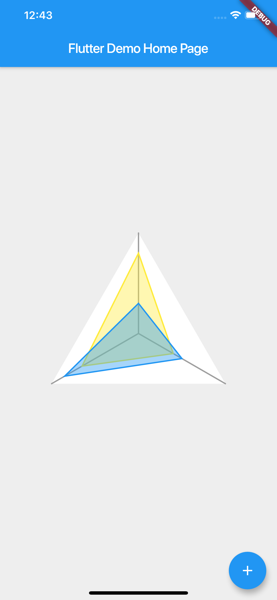

# radar_chart

A new Flutter package project.

## Future work

- Add documentation.
- Handle errors if a RadarTile is out of RadarChart.
-

# Example



```dart
class _RadarChartExampleState extends State<RadarChartExample> {
  int _counter = 3;
  List<double> values1 = [0.4, 0.8, 0.65];
  List<double> values2 = [0.5, 0.3, 0.85];

  void _incrementCounter() {
    setState(() {
      final random = Random(12341);
      _counter++;
      values1.add(random.nextDouble());
      values2.add(random.nextDouble());
    });
  }

  @override
  Widget build(BuildContext context) {
    return Scaffold(
      appBar: AppBar(
        title: Text(widget.title),
      ),
      body: Container(
        color: Colors.grey.shade200,
        child: Center(
          child: RadarChart(
            length: _counter,
            radius: 150,
            initialAngle: pi / 3,
            //backgroundColor: Colors.white,
            //borderStroke: 2,
            //borderColor: Colors.red.withOpacity(0.4),
            radialStroke: 2,
            radialColor: Colors.grey,
            radars: [
              RadarTile(
                values: values1,
                borderStroke: 2,
                borderColor: Colors.yellow,
                backgroundColor: Colors.yellow.withOpacity(0.4),
              ),
              RadarTile(
                values: values2,
                borderStroke: 2,
                borderColor: Colors.blue,
                backgroundColor: Colors.blue.withOpacity(0.4),
              ),
            ],
          ),
        ),
      ),
      floatingActionButton: FloatingActionButton(
        onPressed: _incrementCounter,
        tooltip: 'Increment',
        child: Icon(Icons.add),
      ),
    );
  }
}
```
